### **librería utilizada: Gloss**

### Nuestra experiencia con el laboratorio 1:

Nos encontramos con algunas dificultades a la hora de hacer el lab, algunas de ellas fueron:
El olvido de la sintaxis de Haskell
La confusión de los tipos con respecto a las funciones (sobre todo este)
El desconocimiento de uso de las librería de Gloss con respecto a los vectores
Confusión de los enunciados de cada función

Para resolver confusiones de los enunciados utilizamos la herramienta recomendada por los profes Chatgtp que respondía varias veces de manera precisa aunque éramos conscientes de que podía tener sus fallas, también sirvió consultar a los profes para terminar de entender los problemas de tipos, las funciones, el uso y manejo de los vectores y la librería Gloss así como también terminar de asimilar conceptos. A medida que avanzamos con el lab nos sirvieron los ejemplos que hicieron los profes en clase sobre árboles, lo visto en clases del teórico y el breve repaso de lo aprendido en 1er año (haciendo funciones o viendo los proyectos hechos en primero).
Para algunos fué bastante difícil acostumbrarse a Haskell y la programación funcional así como su exigencia con los Tipos.
Para los test utilizamos github copilot para ahorrarnos tiempo pero notamos que a veces podía fallar porque aún “sigue aprendiendo” pero eso lo podíamos solucionar viendo las definiciones de las funciones y los tipos para poder definir bien los tests aunque a veces los tests con varios casos no eran tan obvios a simple vista.

### ¿Por qué están separadas las funcionalidades en los módulos indicados? Explicar detalladamente la responsabilidad de cada módulo.
Cada módulo tiene su funcionalidad, la separación de estos módulos permite que nuestro lenguaje sea más ordenado y fácil de interpretar para el desarrollador (además de que hay que aprovechar las bondades de Haskell)

En **Dibujo.hs** definimos la semántica del lenguaje, definimos “que puede hacer una figura” y funciones que sean capaces de operar en cada caso de su semántica como foldDib (estructura para la semántica) y mapDib. Además de definir funciones que permiten distintas posiciones/acciones para la/las figura/figuras.
En Pred.hs definimos la estructura de control de flujo (permiten tomar decisiones y ejecutar diferentes acciones en función de si una condición se cumple o no), donde cada función se encarga de definir distintas condiciones con respecto a los predicados.
En **Interp.hs** definimos la interpretación del dibujo donde definimos para cada “acción o constructor definido en Dibujo” su accionar/significado con respecto a nuestro lenguaje,  aquí definimos cada significado con vectores ya que estos nos permiten la ubicación de los distintos puntos de queremos “dibujar” además de definir las operaciones en Dibujo

En **Grilla.hs** se encuentra unas “coordenadas” donde se usó la función **text** para hacer el dibujo, solo es un conjunto de textos que luego se amontonan y se apilan para finalmente imprimirse en pantalla.
Utiliza dos funciones , una que las junta horizontalmente y otra verticalmente que ya venían proporcionadas por la cátedra, y una función Grilla que unía esas dos funciones para que hagan el efecto de coordenadas.

En **Escher.hs** se establece la configuración para después poder hacer un dibujo impuesto por la cátedra, se fue siguiendo las indicaciones del artículo sugerido respetando la idea de las funciones y las sugerencias del enunciado en cuanto a la implementación, hubo algunos problemas para hacer los mosaicos t y u, así que se fue usando como figura básica un triángulo inspirado en el usado en el módulo Ejemplo.hs, y se fueron escribiendo funciones constructoras hasta lograr el resultado esperado, aun así, por una cuestión de tiempo, esos bloques fueron escritos buscando un resultado final y sin buscar ningún tipo de elegancia en el código, así que pueden ser un poco complicados de entender. Fuera de eso no presentó mayores dificultades.

En **Main.hs** convergen todas las funcionalidades de los módulo anteriores, se importan las diferentes configuraciones de los dibujos y se los guarda en un arreglo, además contiene la función principal desde donde se va a ejecutar el programa, se le agregó la posibilidad de pasar como argumento “--list” al ejecutar el programa y la posibilidad de elegir un programa de la lista para imprimir

### ¿Por qué las figuras básicas no están incluidas en la definición del lenguaje, y en vez es un parámetro del tipo?
Las figuras básicas no están incluidas porque esto le permite más flexibilidad al lenguaje, al poder hacer figuras a partir de definiciones propias y poder definir la sintaxis del lenguaje absolutamente independientemente de la librería que se use para definirlas.

### ¿Qué ventaja tiene utilizar una función de `fold` sobre hacer pattern-matching directo?
Una de las ventajas es que va recorriendo recursivamente cada parte de la “rama” y no tiene que ser definido constantemente por casos haciendo pattern-matching, hay un gran ahorro de líneas  y se puede utilizar para varias operaciones (puede ser llamada varias veces dependiendo de la operación) “colapsando” en cada “rama” o elemento dependiendo de los tipos de la función. 

## Dibujos extra:

Se hicieron tres dibujos fractales extra

**Sierpinski.hs:** Este dibujo basado en uno de los fractales más emblemáticos que existen se hizo basándose simplemente en imitarlo a partir de su imagen de la siguiente manera:

1. Se tomó una figura base, en nuestro caso un triángulo isósceles simple

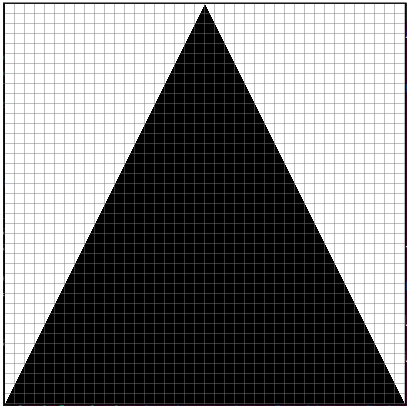

2. Se pensó en el caso recursivo, en este caso fue apilar dos imágenes, la de abajo como dos triángulos uno al lado del otro (donde no hubo problemas de deformaciones de imágenes porque el espacio total se dividía en 2 tanto en algo como en ancho) y arriba un triángulo centrado, en esta imágen si hubo que centrarla y hacer que no se deformara usando la función funjar para agregar espacios en blanco a los costados (con la misma idea de imágenes en blanco usada en Escher.hs)
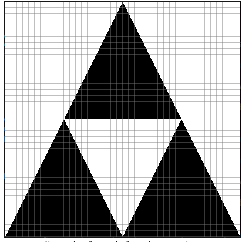

3. Luego sólo restó aplicar más llamadas recursivas, en este caso 5

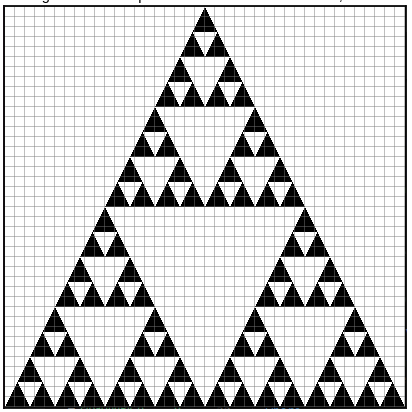

**Alfombra.hs**: Este también es un fractal de Sierpinski, sólo que se le puso otro nombre, es comúnmente conocido como la alfombra de Sierpinski y sigue una lógica bastante similar al anterior, en este caso con cuadrados:
Se hizo la figura base

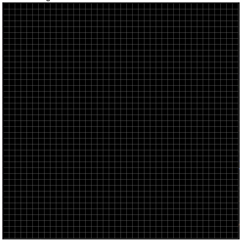

Se planteó como juntarlos y apilarlos de forma recursiva siguiendo el modelo de la imagen, en este paso hubo bastante prueba y error hasta encontrar la forma correcta de hacerlo, para eso fue realmente útil tener una grilla como guía, por más que no se entienda a primera vista con sólo un nivel de recursión consta de 6 bloques del mismo tamaño, donde todos menos el del centro son el bloque que vamos a usar y el del centro sólo blank

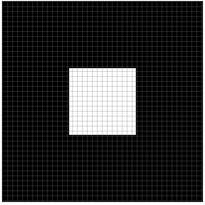

Luego se aplican más llamadas a gusto, en nuestro caso 5

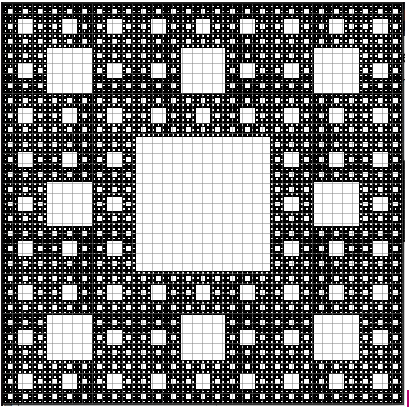

**Triangles.hs**: En este módulo se siguió la siguiente imágen encontrada por internet

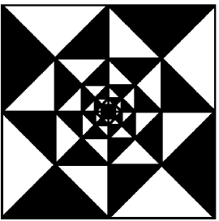

Se la intentó imitar siguiendo los siguiente pasos:
1. Se hizo el siguiente bloque base

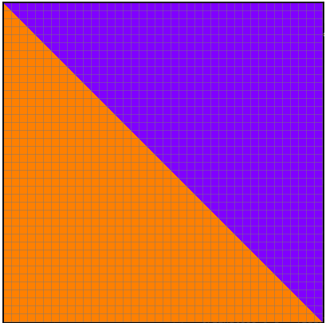

Luego, rotando y espejándolo se usó como dibujos para aplicar cuarteto de la siguiente manera, dejando el 4to cuadrante vacío donde conceptualmente se va a ir aplicando la recursividad

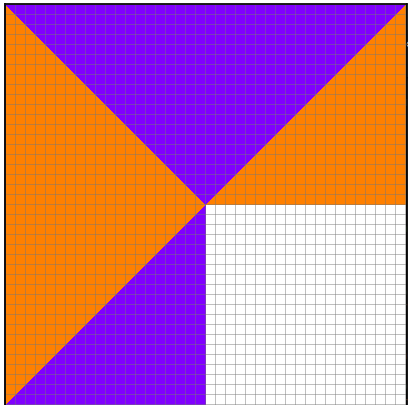

Luego se hacen llamadas recursivas a gusto hasta obtener algo lindo (y que no se vea que el centro quedó de color blanco)

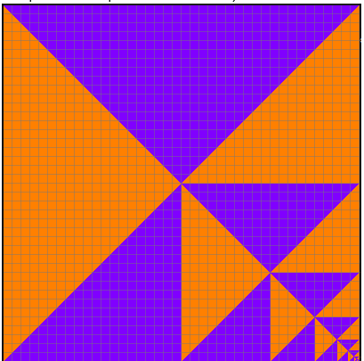

Por último se hace ciclar tomando como parámetro a este dibujo

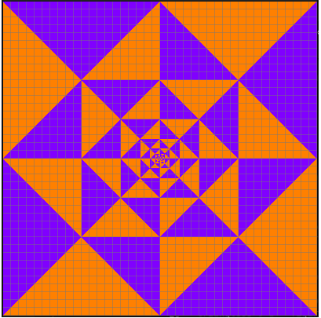

Por último se consideraron otros dibujos que fueron descartados, como este

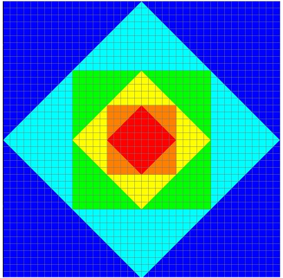

Que era bastante simple conceptualmente pero presentaba el reto de rotar un cuadrado 45 grados pero haciendo que el primer vector sólo se moviese hasta la mitad del espacio de alto, para eso había que implementar una nueva función que use los vectores de la forma a 

x h w = a (x V.+ half w) ((0.5) V.* (w V.+ h)) ((0.5) V.* (h V.- w)). 

Pero por el tiempo que nos quedaba antes de la entrega y no modificar la simplicidad de la definición de los constructores la idea fue descartada. (el dibujo fue hecho modificando la función rot45 para probar como funciona).

### Punto estrella:

Por último se hizo un nuevo constructor llamado Proporciones que permite modificar las proporciones de un dibujo, toma dos Flotantes (x y) y luego modifica las proporciones entre alto y ancho, por ejemplo a partir de esta imágen:
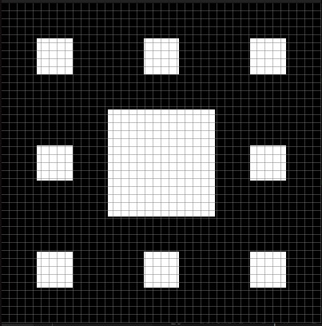
Si se ejecuta "proporciones 2 1 (imagen)", el nuevo dibujo va a tener esta pinta:
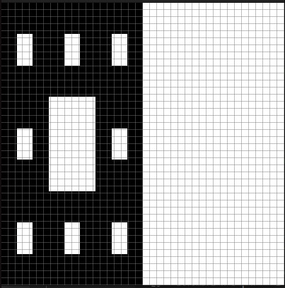
Donde ahora el alto de la imagen es el doble del ancho.
