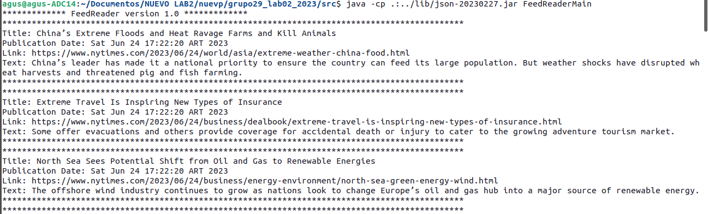
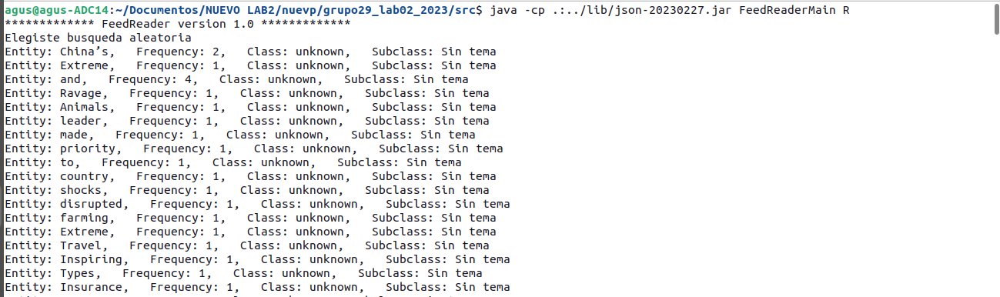
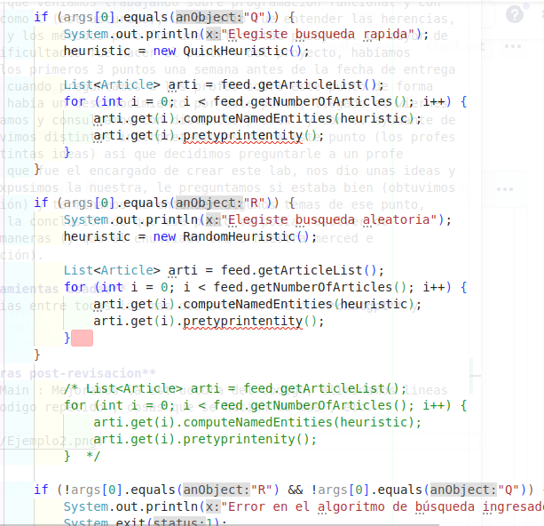
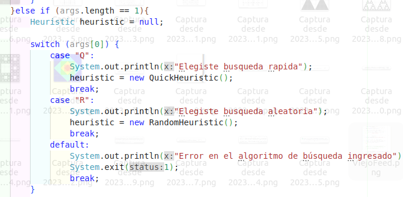
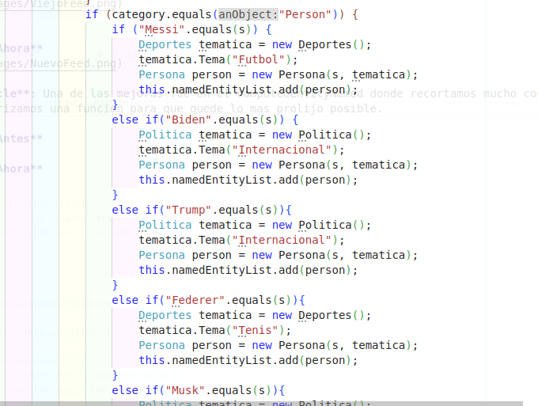
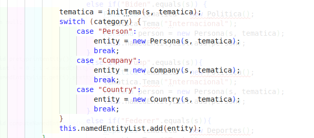
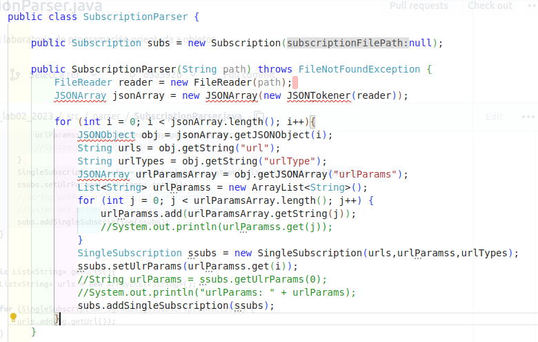
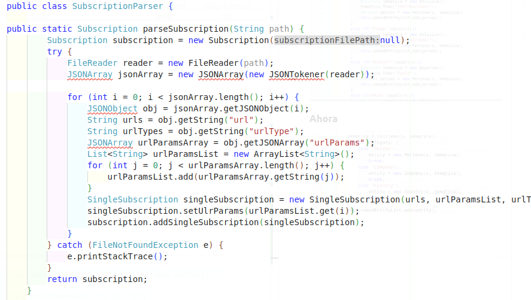
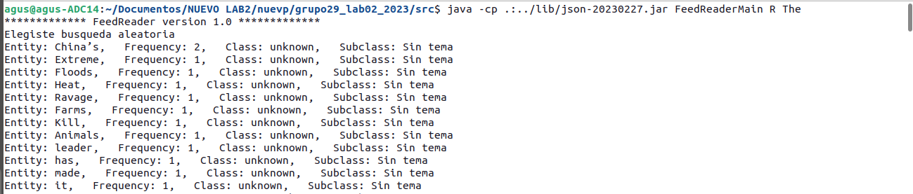
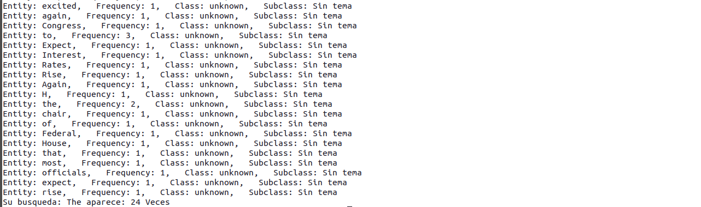

# **Laboratorio 2:**

## **Descripción del proyecto:**
En el proyecto implementamos un parser rss que lee urls de un archivo json, las parsea y obtiene el xml de la página de la url con su temática, forma una lista de artículos extraídos de esa página.

## **Compilación:**
Para elegir la opción RandomHeuristic: java -cp .:lib/json-20230227.jar FeedReaderMain R
Para elegir la opción QuickHeuristic: java -cp .:lib/json-20230227.jar FeedReaderMain Q
Para elegir la opción sin el punto 4: java -cp .:lib/json-20230227.jar FeedReaderMain

Parte del punto estrella de agregar una nueva implementación
Para buscar una palabra aleatoria: java -cp .:lib/json-20230227.jar FeedReaderMain Q "palabra"
java -cp .:lib/json-20230227.jar FeedReaderMain R "palabra"

**Ejemplo de lo que devuelve**

**Otro ejemplo usando heurística de búsqueda**

## **Partes del proyecto:**

**FeedReaderMain:** Es el main principal de todo el proyecto, donde corren las distintas opciones para ejecutar el archivo.
**Paquete feed:** En el paquete feed podemos encontrar 2 archivos, Article en donde define los elementos de un artículo, sus métodos y un pequeño main local. Por otro lado en el archivo Feed encontramos que define una lista de artículos y el tipo de sitio de la página principal, están definidos sus métodos y ejemplos de uso en un pequeño main local.

**Paquete httpRequest:** se encuentra un único archivo llamado httpRequester en donde se hace una conexión con el url del feed, si la conexión sale bien devuelve una cadena de strings que contienen el contenido xml de esa página.

**Carpeta lib:** contiene la librería del archivo json para que java pueda parsear el archivo json

**Paquete parser:** contiene los distintos tipos de parsers para cada caso. El archivo GeneralParser contiene una clase abstracta que luego es implementada/heredada por RssParser y ReditParser (no definida porque era un punto estrella y estábamos con falta de tiempo por hacer el punto 4, la dejamos en el lab por las dudas), en RssParser parsea un archivo de tipo rss y en SubscriptionParser parsea el archivo json que dio la cátedra.
**Paquete subscription:** En ese paquete hay dos archivos, SingleSubscription donde define un objeto que tiene distintos atributos (que corresponden con las características del archivo json).

**paquete nameEntity:** Editamos un poco la clase nameEntity para agregarle un campo donde guarde el Tema al que la Compañía , Persona , etc. Esté relacionado.

Agregamos todas las clases necesarias que eran hijos de nameEntity(Persona , compañía , país) junto con los Temas(Política , Deportes , Cultura) que también son hijos de la clase padre “Tema”.

## **Dificultades a la hora de hacer el laboratorio:**
Tuvimos dificultades para acostumbrarnos a la programación orientada a objetos ya que veníamos trabajando sobre programación funcional y con lenguajes como C (estructurado), un desafío fue entender las herencias, las clases y los métodos pero fue una dificultad pasajera. La mayor de nuestras dificultades fue hacer el punto 4 del proyecto, habíamos terminado los primeros 3 puntos una semana antes de la fecha de entrega acordada y cuando preguntamos a los profes sobre este punto de forma presencial había un desconocimiento por este punto, llegado el viernes 12 preguntamos y consultamos con distintos profes y con el ayudante de alumno, tuvimos distintas interpretaciones sobre este punto (los profes tenían distintas ideas) así que decidimos preguntarle a un profe específico que fue el encargado de crear este lab, nos dio unas ideas y nosotros expusimos la nuestra, le preguntamos si estaba bien (obtuvimos su aprobación) y terminamos de entender algunos temas de ese punto, llegamos a la conclusión de que ese punto se podía resolver de distintas maneras (y que el enunciado era a nuestra merced e interpretación).

## **Herramientas usadas**
Usamos varias entre todas las más destacables fueron **chatgpt**, **poe** y videos cortos de youtube .

## **Mejoras post-revisión**
**General**Antes nos deshaciamos de las entidades que no tenían una categoría asignada.
Agregamos una clase extra para poder inicializar este tipo de entidades.
Minimizamos el código, más adelante muestro mejor, optimizando cosas que se repiten,etc.
Agregamos los test de forma aparte y lo borramos de los mains de cada clase, se pueden correr todos los test desde el archivo Test.java de la carpeta Test.

**FeedReaderMain**Mejoramos la estructura del código, eliminamos líneas extras , código repetido , cosas que se hacían de más , etc.

**Antes**

**Ahora**

**Article**Una de las mejoras fue en el computedEntityNamed donde recortamos mucho código repetido y modilarizamos una función para que quede lo mas prolijo posible.

**Antes**

**Ahora**

**SubscriptionParser**:
Quitamos métodos que eran innecesarios y cambiamos el nombre del atributo por comodidad.

**Antes**

**Ahora**

Y por último pusimos una carpeta donde están los test de algunas clases.

**Punto estrella**
“Agregar al lector de feeds alguna funcionalidad que a ustedes se les ocurra”
Agregamos una función para que se pueda buscar una palabra (Ya sea *entidad* o no) para saber cuántas veces aparece entre todos los artículos. Aquí le dejo un Ejemplo.

