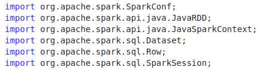
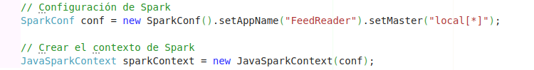
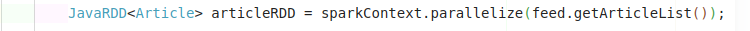

# **Laboratorio 3:Parte Individual**

### **Como se instala spark en una computadora personal?**
Lo primero seria entrar a la pagina de **Apache spark** y luego ir a la seccion de "Download"
consecuentemente se te empezara a descargar la carpeta con las librerias y su configuracion.

### **¿Qué estructura tiene un programa en Spark?**
En java deberia tener las librerias 

Al momento de usar tenes que  cargar la configuracion y luego esa configuracion la cargas como contexto.

Se inicializan variables ya sean tipo RDD para paralelizar u otro tipo.

al final se cierra el contexto 

### **¿Qué estructura tiene un programa de conteo de palabras en diferentes documentos en Spark?**
lo conveniente seria paralelizar los documentos. Luego deberiamos computar las de cada documento utilizando **map** y luego compilar toda esa informacion usando **reduce** 

### **¿Cómo adaptar el código del Laboratorio 2 a la estructura del programa objetivo en Spark?**
Se podia hacer transcribiendo el programa usando las funciones de spark , en mi caso no era tan viable al tener un lab 2 poco pulido , tuvimos que pulir el lab 2 para poder empezar a hacer el lab 3.

En mi caso **chatgpt** que fue mi principal ayuda me recomendo usar una mapHash para hacerlo lo mas facil posible.

