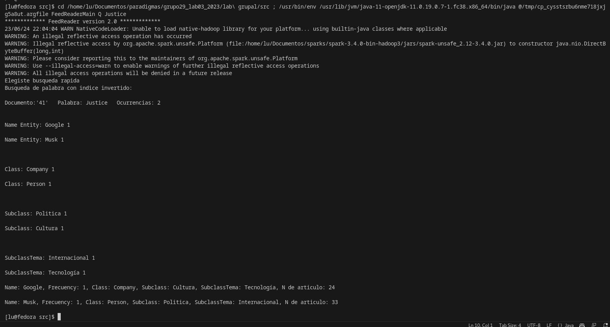

# **Laboratorio 3:Parte grupal**

Tuvimos un problema con uno de nuestros compañeros para poder hacer su laboratorio individual, por ende no pudimos hacer una comparación.

**Compilación:** se presiona run, luego por la terminal aparece un link, se copia el link y se añade la palabra que se desea buscar o la opción que se desea usar Q o R y luego la palabra que se desea buscar.
Ejemplo: cd /home/lu/Documentos/paradigmas/grupo29_lab03_2023/lab\ grupal/src ; /usr/bin/env /usr/lib/jvm/java-11-openjdk-11.0.19.0.7-1.fc38.x86_64/bin/java @/tmp/cp_5si3eb8ix96k4wo65g1kh5xez.argfile FeedReaderMain Q Justice
Otra forma también es:
javac -proc:none -cp .:../lib/* FeedReaderMain.java
java -cp .:../lib/* FeedReaderMain Q/R Titanic (o alguna otra palabra que se desee buscar)

**Añadir .jar** se copia todos los .jar nativos de apache sparks, si la IDE utilizada es Visual Studio Code se debe buscar la opcion JAVA PROYECTS que aparece en la esquina inferior derecha, se abre References Library y se pega los .jar que se necesitan para correr el programa, también se puede hacer una carpeta aparte lib y copiar y pegar todos los .jar ahí.

## **Desventajas y ventajas de las implementaciones individuales**
Laboratorio de Lourdes(desventajas): No es completamente paralelo, si bien se aplica map y reduce en los documentos de forma paralela carece de paralelización de los subscriptions (en el bucle for), falta más modularización y optimizacion de codigo, aunque fue la mejor opcion.
Laboratorio de Lourdes(ventajas): posee algunas modularizaciones del lab 2 y problemas corregidos, la impresión por consola no es exhaustiva, mejoras con respecto a las clases, subclases y subtemas.

Laboratorio de Agustin(Desventajas) : Tampoco es completamente paralelo , además rompe con lo de que el Article tiene la lista de entidades en privado , tuve que hacerlo público y no creo que sea una buena idea. Además de otros problemas con el código que arrastramos de antes. Casi terminando el lab grupal me di cuenta que está mal implementado el spark.
. 
Laboratorio de Agustin (Ventajas): es un código medianamente corto sin modularizar y aprovecha las cualidades del hashmap , que luego lo terminamos aplicando en el lab grupal.

## **¿Por qué elegimos esta implementación?**
Por qué era lo que más se acercaba a lo que se pedía en el laboratorio, si bien no era completamente paralelo cumplía con la mayoría de las especificaciones del laboratorio. Tuvimos que hacerle mejoras para que sea completamente paralelizable pero mantuvimos las ideas principales, en una próxima sección explicaremos los cambios.

## **Cómo se recupera documentos por palabras clave** ##

Tuvimos dos implementaciones desarrolladas y optamos por la siguiente:

### **Primera implementación:** ###
1. Primero hacemos un índice invertido con un **Hashmap** y el identificador del artículo.
2. Recolectamos todos los índices invertidos hechos en una lista.
3. Hacemos una lista auxiliar para agregar todas las ocurrencias de la palabra previamente aclarada.
4. Imprimimos la palabra junto a todas sus ocurrencias y en su respectivo documento.

*¿Cómo se nos ocurrió una hashMap ?*

Hablando con un compañero y preguntando a **chatgtp** descubrimos que era la mejor forma de hacer un “Diccionario” debido a su inmediatez en la búsqueda de datos.

### **implementación descartada:** ###
Esta era un poco más costosa... Creamos un objeto nuevo llamado Word que tiene de atributos la palabra
y su ocurrencia. En article aparte de tener una lista donde guardaba las entidades nombradas también
teníamos una lista donde guardaba las palabras que no eran entidades.

Editamos un poco el computedNameEntitys para que guarde , además , las palabras *no entidades* en
su respectiva lista para luego en el main , al momento de buscar , se fije si es una entidad o no y donde va buscar.

La misma fue rechazada porque no cumplía exactamente con los criterios del laboratorio. Ya que se
estaba implementando sin un índice invertido.

De todas formas reutilizamos la idea para un punto estrella del lab 2.

**Imagen ilustrativa:** Ejemplo Justice

## **Material utilizado** ##
En su mayoría usamos **chatgpt** , para la mayoría de consultas. Otras pocas veces de algún que otro videos de **youtube** explicando spark y dando un ejemplo, páginas de internet como https://sparkbyexamples.com/spark/spark-word-count-example/ 
También documentación de **apache sparks** y **poe** (que incluye otras IA).

## **Experiencias** ##

La parte más difícil del laboratorio fue la compilación que va a ser explicada detalladamente en los problemas principales.

Aprender a como usar spark fue ligeramente complejo pero con *chatgpt* se agilizan mucho las cosas. Quizás el reto mayor era entenderlo semánticamente , ya que es muchísima información y había que ver qué cosas valen la pena entender.
También aprendimos a modularizar en java como primerizos en este lenguaje (aunque Lu tenía un poco de conocimiento previo).

## **Problemas Principales** ##

Uno de los problemas principales fue compilar. Al principio no sabíamos cómo compilar el código , pasamos por **maven** pero no pudimos,
preguntamos a compañeros y a profesores y la conclusión fue
quedarnos con la compilación de **visual studio** ya que era la más sencilla, también compilamos con javac desde la terminal.

Veníamos con un lab 2 poco pulido entonces tuvimos que pulirlo para poder hacer más amigable el código.

Otro problema fueron las versiones de java y su compatibilidad con Spark. Tuvimos que desinstalar java y volverlo a instalar , un par de veces , para que no nos dejará errores al compilar. Uno de nuestros compañeros tuvo que desinstalar todas las versiones de java para que le funcionara perfectamente.
Otro de los inconvenientes fue que en jdk 17.0.0 no le corría sparks (a pesar de que en la documentación contemplaba la versión con sparks 3.4.0), entonces la mejor opción fue jdk 11.

Por último terminando el laboratorio, nos dimos cuenta de que no era completamente paralelizable y tuvimos que rehacer una parte del código, donde primero obtenemos de forma paralela toda la lista de artículos de todos los feeds, luego aplicamos de la misma manera los demás pasos, obtención de name entities y aplicar el índice invertido (todo explicado anteriormente), todo esto para cumplir con la especificación de que sea paralelizable. Si lo haciamos de la anterior manera con un for each con RDD , dentro los **maps** y **reduce** el código no se compilaba ya que no se puede definir un RDD dentro de otro RDD, por ello lo dividimos en 2 partes, la primera de obtención de artículos y la segunda la obtención de entidades nombradas, ocurrencias generales y la búsqueda de palabra por índice invertido.

NOTA: en los archivos de modularización no pudimos hacer paralelos algunos for porque tenían un for each paralelo afuera, no se podia implimentar un RDD dentro de otro RDD. 

Por último y no menos importante

